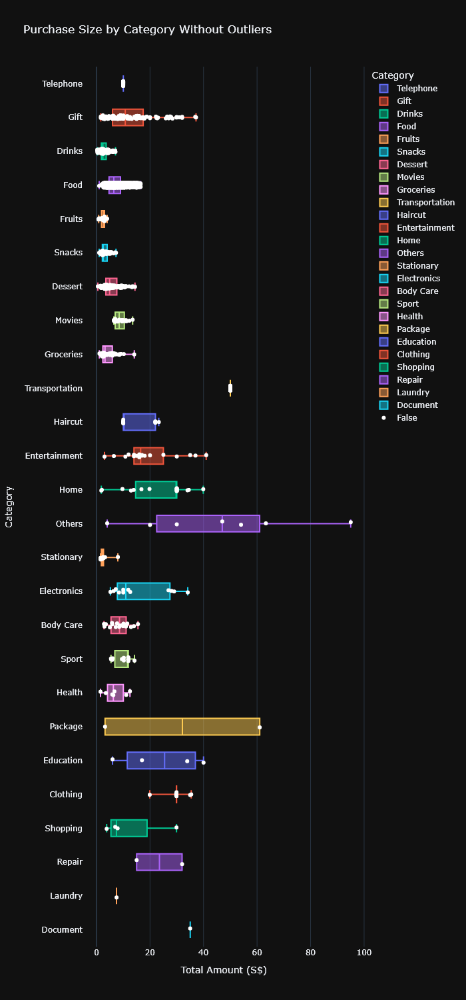
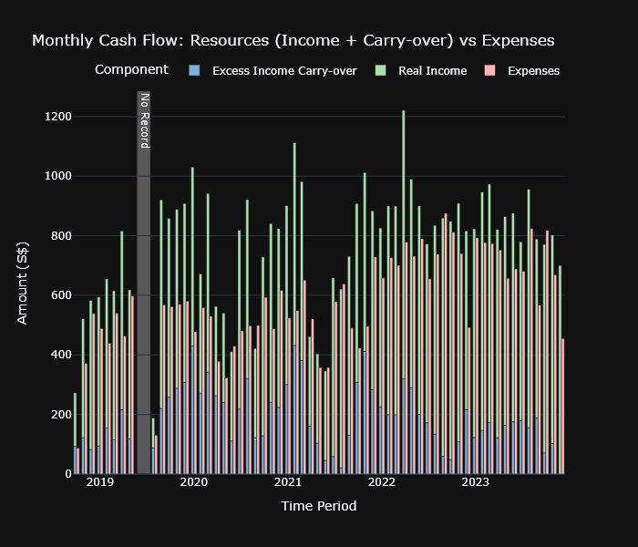
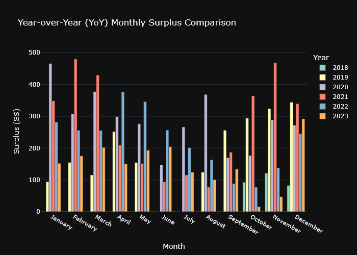
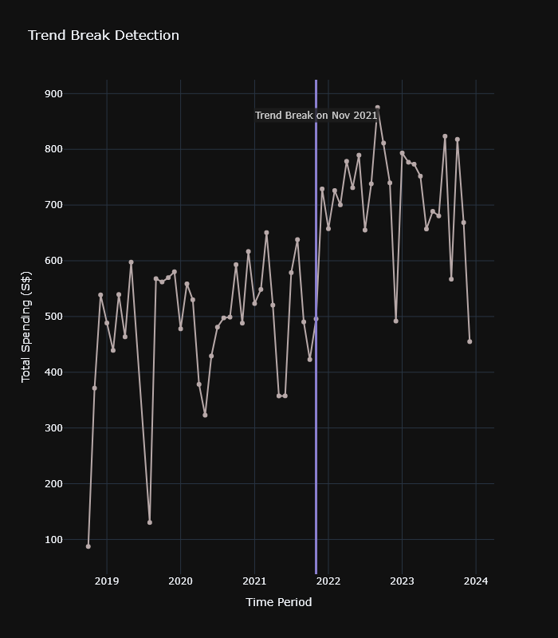

# Data Analysis Report

Report generated on: 12/02/2026 01:29:51

Because GitHub is unable to display Plotly interactive figures, a dynamic report is generated to compile each figure along with their respective captions.

For interactive features, please refer to the Jupyter notebooks in the 'NOTEBOOKS/' directory and rerun the cells to generate the plots.

<hr>

<hr>

## Descriptive Analysis

Identification on what is in the data


### Global View of Expenses & Income

*  Total amount of Expenses: S$35,268.00 and total number of expense transactions: 3667

*  Total amount of Income: S$47,037.65 and total number of income transactions: 204

#### Spending by Category (Top 7 + Others)

<p align='center'></p>

* Top 7 categories account for 88.82% of the total spending with the highest category spending being Food at 66.29%.


### Distribution Visualisation & Analysis

To analyse the distribution of purchase frequency in histogram and boxplot to show clarity on the skewness and common amounts


#### Distribution of Purchase Sizes (Histogram)

<p align='center'></p>

* The general spending amount distribution is heavily concentrated in the lower value range (left side), with a long right tail.
This pattern reflects frequent low-cost purchases (such as, daily food or transport) and a few large-value expenses, possibly one-
time or monthly essentials.


#### Descriptive Statistics Summary


<div align='center'>

```markdown
| Metric              | Value   |
|:--------------------|:--------|
| Count               | 3,331   |
| Mean                | 6.95    |
| Median              | 6.50    |
| Standard Deviation  | 3.51    |
| Minimum             | 0.30    |
| Lower Outlier Bound | -3.75   |
| Q1 (25%)            | 4.50    |
| Q3 (75%)            | 10.00   |
| Upper Outlier Bound | 18.25   |
| Maximum             | 18.20   |
| IQR                 | 5.50    |
| Skewness            | 0.85    |
| Kurtosis            | 0.52    |
```

</div>

*  The overall spending distribution is moderately right-skewed (0.85) indicating a higher concentration of small purchases along
with a few large outliers. The kurtosis (0.52) suggests extreme spending events are relatively rare and the distribution is more
flattened than a normal bell curve.

#### Distribution of Purchase Sizes Without Outliers (Histogram)

<p align='center'></p>

* Upon visualised, there are considerable number of outliers beyond Upper Outlier Bound.


<hr>

## Behavioral Patterns

Analysis to answer the question how I spend


### General View of Purchase Size by Category

To showcase which categories have the largest typical purchase


#### Purchase Size by Category

<p align='center'></p>

* Since each category has distinct data range and descriptive statistics, it is only reasonable the outliers are detected within
each category separately. Upon outlier detection, red and white dots signify outlier and non-outlier data points respectively.


#### Purchase Size by Category Without Outliers

<p align='center'></p>

* In contrast, this boxplot contains no outlier.


### Spending Behaviour Based on the Days within the Week

To show the spending pattern within the days of the week


#### Spending Behaviour by Day of the Week

<p align='center'></p>

* Spending is highest on Sunday, with average transaction values approximately 18.9% above the average levels of the other days in
a week.


*  Weekdays reflect routine low-value spending (e.g., transport, food).

*   Mondays reflect the lowest spending level across the days which are aligned as there is typically no outside activities (e.g.
going out, eating out) on Mondays.

### Weekends vs Weekdays Analysis

To show the comparison of spending between weekends and weekdays


#### Spending Behaviour by Day Type (Weekday vs Weekend)

<p align='center'></p>

* Upon looking at the presented boxplot, the Spending is greater on Weekends than it is on Weekdays. In this case the significance
of the difference needs to be assessed to obtain better understanding on the Spending Behaviours throughout the week.  From the
histogram previously, the data is extremely right-skewed.


Hypotheses for One-Tailed Test:
- Null Hypothesis: average amount spent on weekend less than or equal to average amount spent on weekday 

    i.e. $H_0: \mu_{weekend} \leq \mu_{weekday}$
- Alternative Hypothesis: average amount spent on weekend greater than average amount spent on weekday 

    i.e. $H_1: \mu_{weekend} > \mu_{weekday}$


 The result of the first statistical test is as follows:


<div align='center'>

```markdown
| Metric      | Value                      |
|:------------|:---------------------------|
| Test        | Mann-Whitney U Test        |
| p-value     | 0.00                       |
| Group1_Mean | 10.70                      |
| Group1_CI   | (9.71, 11.69)              |
| Group2_Mean | 9.23                       |
| Group2_CI   | (8.72, 9.74)               |
| Conclusion  | Reject $H_0$ (Significant) |
```

</div>

 With the p-value 0.00 < 0.01, it is discovered that there is a statistically significant difference on average spending between
weekends and weekdays. Hence, Reject $H_0$ (Significant) at 99.0% confidence level.


 Depending on culture and life stage, Friday is sometimes considered as "weekend-like" periods according to many businesses
because Friday night spending is often social or leisure. Another set of analysis is redone with the inclusion of Friday
considered as weekend


#### Spending Behaviour by Day Type (Weekday vs Weekend + Friday)

<p align='center'></p>

* Upon looking at the presented boxplot, the Spending is still greater on Weekends than it is on Weekdays. The signficance test is
going to be recalculated to confirm the findings.


 The result of the second statistical test is as follows:


<div align='center'>

```markdown
| Metric      | Value                      |
|:------------|:---------------------------|
| Test        | Mann-Whitney U Test        |
| p-value     | 0.00                       |
| Group1_Mean | 10.35                      |
| Group1_CI   | (9.53, 11.17)              |
| Group2_Mean | 9.10                       |
| Group2_CI   | (8.58, 9.63)               |
| Conclusion  | Reject $H_0$ (Significant) |
```

</div>

 With the p-value 0.00 < 0.01, it is discovered that there is a statistically significant difference on average spending between
weekends and weekdays. Hence, Reject $H_0$ (Significant) at 99.0% confidence level.


### Geospatial Visualisation

To visualise the geographical distribution of the data


#### Spending Heatmap by Region

<p align='center'></p>

* Each point represents a region of transaction activity. Size corresponds to the number of transactions (log scale), where larger
points correspond to areas with more frequent transactions. Meanwhile, the average spending per transaction is represented by the
blue-red colour scale with blue being the lowest average spending and red being the highest.


*  The Geospatial Heatmap displays various distinct zones of highly-frequent low-cost transactions (e.g. Clementi and Tanjong
Pagar), likely reflecting habitual daily spending patterns around home, school, and/or work.

*  On the contrary, areas such as Jalan Besar and Boon Keng show much higher average spending per visit despite of minimum visits,
representing discretionary purchases.

*  Such contrast underlines a duality of spending behaviours where on the functional zones, there is a habitual spending
concentration with occasional higher consumption on other districts.

### Volume vs Value Analysis

To compare districts where spending is frequent vs expensive to support behavioural insights


#### Volume vs. Value by District

<p align='center'></p>

* The chart above compares all districts by Transaction Count (volume), Total Spending (value), and Average Amount per Transaction
(intensity), each normalised between 0 and 1 where 0 represents values close to the Minimum within the column and 1 the Maximum
within the column.


*  Clementi shows the highest normalized Transaction Volume and Total Spending, indicating it is by far the most frequently visited
location, likely reflecting a habitual area such as a school or home base. On the other hand, its Average Amount per Transaction
is low, suggesting small, routine purchases.

*  On the contrary, Outram Park has a low number of transactions, but the highest average spending per visit, suggesting it is used
for rare but expensive purchases - possibly special dining, shopping, or events.

*  Mid-tier districts like Tanjong Pagar and Jurong East show moderate activity across all metrics, suggesting balanced use cases -
both frequent and moderately costly.

 Normalization provides better comparison for visualisation, however, it is worth noting that it masks absolute differences -
Clementi's transaction count could be 10x higher than others, even if shown as only slightly above in the chart.


<hr>

## Temporal Trends

How the behaviour changes over time


### Monthly Spend

To show the seasonality of the spending on the monthly bucket


#### Monthly Spending Pattern (Stacked by Year)

<p align='center'></p>

* The graph shows the monthly spending trend for each year. The stacked bars indicate the total spending amount per month for each
year.


#### Monthly Spending Trend

<p align='center'></p>

* A line chart displays the monthly spending trend throughout the data horizon to identify the overall spending trend.


*  Note: There is a visible drop in spending between June and August 2019. This reflects a period during which data was not
recorded, not a behavioral change. Interpret trends around this period with caution.  The following periods are when the data was
not recorded completely and hence, no data point: June 2019 & July 2019. Due to this, these periods need to be marked in the
subsequent steps.

#### Monthly Spending Trend

<p align='center'></p>

* The specified periods where the data is missing are highlighted in the graph using gray shading and annotated as "No Record".


#### Monthly Spending Trend with Moving Average

<p align='center'></p>

* The holistic monthly spending trend is shown in the graph, with the original data points and a 3-month, 6-month and 12-month
moving average.


#### Seasonality Index (Scaled from -1 to 1)

<p align='center'></p>

* To better visualise the Seasonality Index, a Bar Chart scaled from -1 to 1 is used. From the graph, it is discovered that the
range of Seasonality Index is not beyond the scale between -0.1 to 0.1. Therefore, spending is not strongly seasonal; variability
is likely driven by events, not months.


### Surplus/Deficit Analysis

To analyse the surplus/deficit in the spending pattern


#### Monthly Cash Flow: Resources (Income + Carry-over) vs Expenses

<p align='center'></p>

* Throughout the horizon of the analysis, the monthly cash flow reflects a consistent surplus each month triggering a growing
cumulative excess income indicating a sustainable savings habits.Occasional months reflect extremely low spending are due to the
Circuit Breaker imposed during Covid-19 pandemic and therefore, the income along with carry-over can exceed twice as much expenses
during those months. Overtime, the spending has been escalating as the cost of living and lifestyle in general have been climbing
altogether.


#### Cumulative Surplus Analysis

<p align='center'></p>

* The graph shows the cumulative surplus analysis for each month. The bars indicate the cumulative surplus amount per month.


#### Cumulative Surplus Analysis

<p align='center'></p>

* Since both June and July 2019 do not have any data points, these periods are skipped in the table. Logically, these periods
should remain flat and consistent with the balance of the previous month since the timeline is continuous and these two months are
periods of inactivity with no financial change. According to the Cumulative Surplus Analysis, the final cumulative surplus is
S$13560.95 on December 2023.


<hr>

## Diagnostic & Comparative Analysis

Analysis to diagnose and compare data according to the financial events


### Year-on-Year (YoY) Comparison

To analyse the evolution of spending over the years


#### Year-over-Year (YoY) Monthly Surplus Comparison

<p align='center'></p>

* Strong surpluses generally happen in January, February, March of each year linked of the low-season holiday activities since
these periods are more intensive due to exams and work. Some weaker surpluses of June, July, August are linked to the mid-of-the-
year big purchases. The absence of strong month-to-month seasonality suggests that financial behavior is primarily driven by life
circumstances or irregular events rather than fixed cycles


### Trend Break Detection

To identify if there is a change of pattern in spending


#### Trend Break Detection

<p align='center'></p>

* A Trend Break is detected on November 2021 which is linked with the increased spending due to the beginning of employment upon
graduation. Pelt/Binary Segmentation from the RPT package is used to detect the trend breaks. The approach is prioritise for
efficient search for the optimal breakpoints using dynamic programming and actively recursively splits the signal to detect
multiple changes.


<hr>

## Predictive & Prescriptive

Leveraging on the analysis and data to optimise the financial planning for the future horizon


### Time Series Decomposition & Forecast Foundations

To determine the forecast baseline for future horizons given the historical data


* In order to break down complex time series data into three core components: a long-term Trend, repeating Seasonal patterns, and
random Residuals (noise), the Seasonal-Trend decomposition using LOESS (STL) method is employed. This technique is particularly
effective for handling time series data with strong seasonal effects and can accommodate any type of seasonality. By decomposing
the data, we can better understand the underlying patterns and make more informed decisions regarding budget recommendations.

* The following formula is used to explain the STL Decomposition: 


<div align='center'>


 $Observed = Trend + Seasonality + Residual
$


</div>

#### STL Decomposition of Monthly Expenses

<p align='center'></p>

* Observed Monthly Expenses are volatile based on the monthly spending pattern. The Trend component shows a gradual increase in
spending over time, indicating a rising cost of living or lifestyle changes. The Seasonality component reveals recurring patterns,
with peaks and troughs corresponding to specific months, likely influenced by holidays or annual events. The Residuals capture
irregular spending that does not follow the trend or seasonal patterns, representing one-off expenses or anomalies.


#### ETS Forecast of Monthly Expenses (Next 24 Months)

<p align='center'></p>

* The ETS forecast predicts the monthly expenses for the next 24 months, showing a continued upward trend in spending. This
suggests that without changes in spending habits or external factors, expenses are expected to rise steadily. The forecast can
help in budgeting and financial planning by providing an estimate of future costs based on historical patterns.


#### Historical and Forecasted Monthly Expenses (ETS)

<p align='center'></p>

* Combining historical spending data with ETS forecast provides a comprehensive view of past trends and future expectations. The
historical data shows actual spending patterns, while the forecasted data indicates where expenses are likely headed. This
combined view aids in understanding how past behaviors influence future financial planning and budgeting.


* Based on the time series decomposition and forecasting results, monthly expenses are projected to remain on an upward trajectory,
with an estimated average monthly expenditure of approximately $812.73 over the forecast horizon. This projection reflects the
continuation of long-term spending trends and recurring seasonal patterns observed in the historical data.  While short-term
fluctuations are expected, the forecast provides a stable baseline for forward-looking financial planning rather than precise
month-level predictions.

#### SARIMA Forecast of Monthly Expenses

<p align='center'></p>

* Given historical data and model assumptions, there is a 95.0% probability that actual expenses will fall within this range. If an
actual monthly expense exceeds the upper bound, it signals potential overspending requiring attention, while staying below the
lower bound indicates underspending. The widening confidence interval reflects increasing uncertainty over longer forecast
horizons, underscoring the need for regular forecast updates as new data becomes available.


* With a statistically validated SARIMA model and clearly defined confidence bounds, deviations beyond expected expenditure ranges
can be systematically identified. This establishes a robust early warning mechanism that flags abnormal spending behavior before
it compounds, enabling proactive financial intervention.

#### SARIMA Model Residual Diagnostics

<p align='center'></p>

* The residual diagnostics validate the SARIMA model's adequacy: (1) Residuals oscillate randomly around zero with no systematic
patterns, indicating proper trend and seasonal capture; (2) The distribution is approximately normal and centered at zero, with
most errors within -200 to +200, though heavier tails suggest occasional extreme spending events; (3) The Q-Q plot shows good
alignment in the central region with deviation at extremes, typical for financial data with outliers; (4) ACF values decay rapidly
and stay within confidence bounds (except lag-0), confirming no remaining autocorrelation. Overall, the model effectively captures
the time series structure, with residual deviations attributable to genuine anomalies rather than model inadequacy.


#### Model Comparison: ETS vs SARIMA

<p align='center'></p>

* The comparison reveals distinct behavioral differences between ETS and SARIMA models. ETS produces smoother, more stable
forecasts by gradually weighting historical data, making it less reactive to recent changes. In contrast, SARIMA demonstrates
higher sensitivity to recent spending patterns, particularly visible in the post-2023 period where it captures the downward trend
more aggressively. This adaptive characteristic makes SARIMA more suitable for anomaly detection, as it adjusts its baseline
expectations faster, allowing genuine deviations to be detected rather than being masked by outdated historical averages. The
trade-off is increased forecast variance, but for early warning systems, responsiveness to recent patterns outweighs smoothness.


### Early Warning & Anomaly Detection

To predict overspending in the future based on the trends


* Backtesting serves as our primary anomaly detection method. By performing  rolling-window forecasts and comparing predictions to
actual values, we can: 1. Identify months where actual spending falls outside predicted confidence intervals 2. Ensure anomalies
are detected based on historical patterns, not one-time model fit 3. Validate detection robustness across different time periods
Anomalies are flagged when actual expenses fall outside the 95% confidence interval of the SARIMA forecast.

#### Anomaly Detection via Confidence Intervals Backtesting

<p align='center'></p>

* The back-testing results demonstrate the SARIMA model's effectiveness in forecasting monthly expenses, with most actual values
falling within the predicted confidence intervals. Detected anomalies highlight months where spending deviated significantly from
expectations, validating the early warning system's capability to identify potential overspending events.


* By systematically back-testing the SARIMA model over the past 12 months, we have validated its predictive accuracy and reliability
in identifying spending anomalies. The model's ability to flag deviations beyond established confidence intervals provides a
robust early warning mechanism, empowering proactive financial management and timely interventions to mitigate overspending risks.
The following months are flagged as anomalies: Jan 2023, Dec 2023. The months identified can be further investigated to understand
the underlying causes and implement corrective actions as needed since they represent significant deviations from expected
spending patterns.

#### Forecast Error Distribution & Patterns

<p align='center'></p>

* Analysis of forecast error distribution reveals the nature of prediction uncertainty. The left panel shows error distribution
against a normal curve, testing the assumption that forecast errors follow a symmetric, bell-shaped pattern. Deviations from
normality, particularly in the tails, indicate the presence of outliers or skewed prediction errors. The right panel examines
whether forecast accuracy varies with spending level (heteroscedasticity). A flat trend line around zero suggests consistent
accuracy across all spending magnitudes, while a sloped trend indicates systematic over or under-prediction at different expense
levels. This diagnostic helps identify whether model adjustments or stratified forecasting approaches are needed.


* Using Z-score threshold of 1.5 since the maximum observed Z-score is 1.91, which indicates that there are significant deviations
in the residuals. A threshold of 1.5 standard deviations effectively captures these anomalies while minimizing false positives.
This threshold balances sensitivity and specificity, ensuring that genuine anomalies are detected without overwhelming the system
with false alarms. In this case, the months identified as anomalies based on Z-score analysis are: Jan 2023, Dec 2023.

#### IQR-Based Anomaly Detection

<p align='center'></p>

* IQR-based anomaly detection uses the interquartile range (Q1=$665.70, Q3=$780.95, IQR=$115.25) to define normal spending
boundaries. The upper fence ($953.82) and lower fence ($492.83) are set at 1.5× IQR beyond Q1 and Q3 respectively, following
standard statistical outlier detection conventions. The time series panel shows spending against these thresholds, with shaded
regions indicating normal (teal) and caution (yellow) zones. The box plot confirms the spending distribution's central tendency
and spread, while the histogram reveals the frequency distribution relative to IQR boundaries. This method is robust to non-normal
distributions and complements the CI-based detection by focusing on the actual spending distribution rather than model
predictions.


* By applying the IQR method, we have established robust bounds for normal spending behavior based on historical data distribution.
The calculated lower bound is 492.83 and the upper bound is 953.82. Any actual monthly expense falling outside these bounds is
flagged as an anomaly, indicating significant deviations from typical spending patterns. The months identified as anomalies based
on IQR analysis are: Dec 2023.

#### Moving Average (3-Month) Anomaly Detection

<p align='center'></p>

* Moving average anomaly detection uses a 3-month centered rolling average to establish dynamic spending baselines, adapting to
gradual trend changes rather than using fixed static thresholds. The teal shaded envelope represents the ±25% normal deviation
band around the moving average. The absence of MA-detected anomalies is a meaningful finding: while CI-based and Z-score methods
flagged isolated monthly spikes, the moving average confirms these were brief, self-correcting deviations rather than sustained
trend shifts. This distinction is important for financial monitoring as it suggests the anomalies did not alter the underlying
spending trajectory. The deviation panel (bottom) quantifies month-to-month volatility relative to the rolling baseline, providing
additional context for spending rhythm and consistency.


* By analyzing deviations from the 3-month moving average, we have identified months where spending significantly diverged from
recent trends. A threshold of 25% deviation effectively captures these anomalies, highlighting periods of unusual spending
behavior. The months identified as anomalies based on moving average deviation analysis are: Feb 2023, Mar 2023, Apr 2023, May
2023, Jun 2023, Jul 2023, Aug 2023, Sep 2023, Oct 2023, Nov 2023.

#### Detected Anomalies - Detailed Analysis

<p align='center'></p>

* Comprehensive breakdown of detected expense anomalies during back-testing period. Each anomalous month is characterized by actual
spending, model forecast, confidence interval bounds, deviation magnitude, and classified by type (overspending vs underspending)
and severity (mild/moderate/severe). Color coding highlights overspending (red) and underspending (green) patterns. The error
column quantifies dollar deviation from forecast, while deviation percentage enables comparison across different spending levels.
This granular analysis facilitates investigation into root causes and informs budget adjustment strategies.


* Anomalies confirmed by multiple detection methods provide higher confidence in their validity. By requiring consensus from at
least two independent techniques, we mitigate the risk of false positives inherent in any single method. This multi-faceted
approach ensures that flagged anomalies represent genuine deviations from expected spending patterns, warranting further
investigation. The months identified as consensus anomalies are: Jan 2023, Dec 2023.

### Budget Recommendation

To determine the recommended budget level for the future periods


#### Monthly Expenses with Budget Recommendation

<p align='center'></p>

* The budget recommendation is derived from the ETS forecast of monthly expenses, adjusted by a safety buffer of 50% to account for
variability in spending. This approach ensures that the recommended budget not only reflects expected costs but also provides a
cushion against unforeseen expenses, promoting financial stability and preparedness.


* Based on the forecasted spending trajectory and historical variability, the recommended monthly budget is SGD 907.04, which
includes a safety buffer of 50% to account for typical spending fluctuations.

---

For more information, please refer to the Data Analysis Report Notebook [here](NOTEBOOKS/CASH_FLOW_DATA_ANALYSIS.ipynb) directory.
