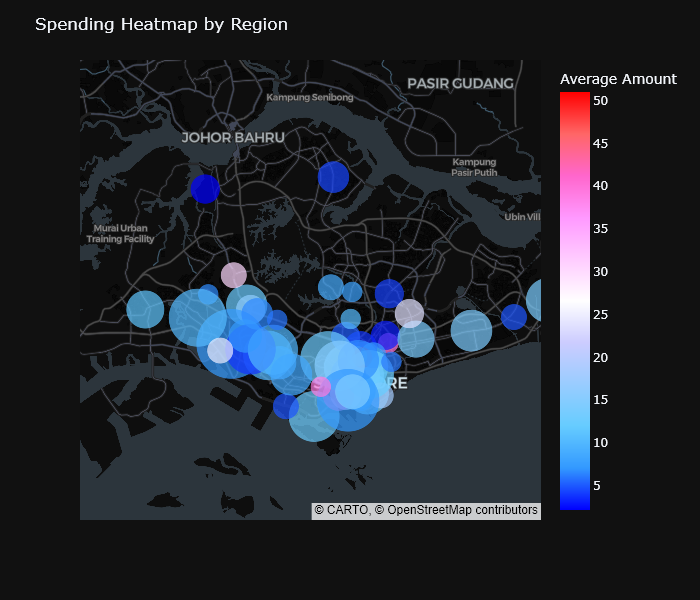
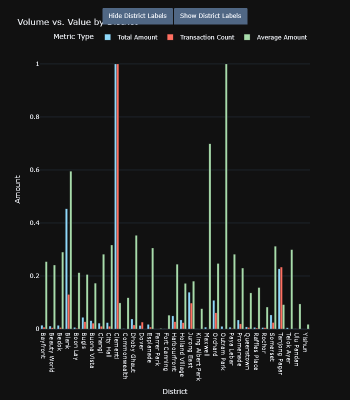
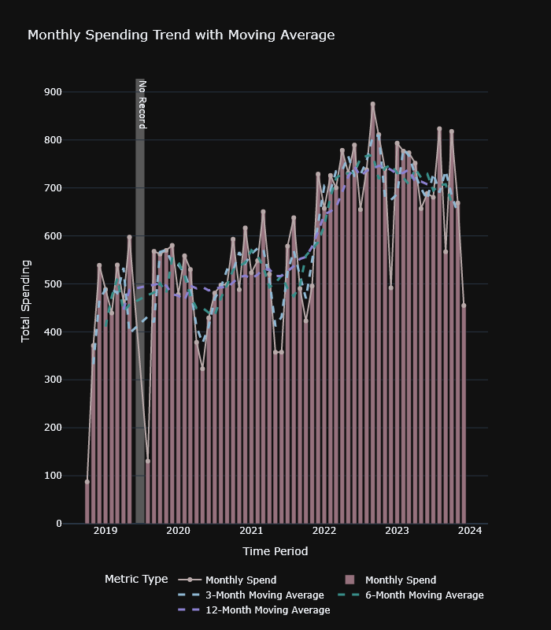

# Data Analysis Report

Report generated on: 09/07/2025 15:09:45

## Spending by Category (Top 7 + Others)

* Top 7 categories account for 88.82% of the total spending with the highest category spending being Food at 66.29%.

## Distribution of Purchase Sizes (Histogram)

* The general spending amount distribution is heavily concentrated in the lower value range (left side), with a long right tail.
This pattern reflects frequent low-cost purchases (such as, daily food or transport) and a few large-value expenses, possibly one-
time or monthly essentials.

## Distribution of Purchase Sizes Without Outliers (Histogram)

* Upon visualised, there are considerable number of outliers beyond Upper Outlier Bound.

## Purchase Size by Category

* Since each category has distinct data range and descriptive statistics, it is only reasonable the outliers are detected within
each category separately. Upon outlier detection, red and white dots signify outlier and non-outlier data points respectively.

## Purchase Size by Category Without Outliers

* In contrast, this boxplot contains no outlier.

## Spending Behaviour by Day of the Week

* Spending is highest on Sunday, with average transaction values approximately 18.9% above the average levels of the other days in
a week. Weekdays reflect routine low-value spending (e.g., transport, food). Mondays reflect the lowest spending level across the
days which are aligned as there is typically no outside activities (e.g. going out, eating out) on Mondays.

## Spending Behaviour by Day Type (Weekday vs Weekend)

* Upon looking at the presented boxplot, the Spending is greater on Weekends than it is on Weekdays. In this case the significance
of the difference needs to be assessed to obtain better understanding on the Spending Behaviours throughout the week.  From the
histogram previously, the data is extremely right-skewed.

## Spending Behaviour by Day Type (Weekday vs Weekend + Friday)

* Upon looking at the presented boxplot, the Spending is still greater on Weekends than it is on Weekdays. The signficance test is
going to be recalculated to confirm the findings.

## Spending Heatmap by Region

* Each point represents a region of transaction activity. Size corresponds to the number of transactions (log scale), where larger
points correspond to areas with more frequent transactions. Meanwhile, the average spending per transaction is represented by the
blue-red colour scale with blue being the lowest average spending and red being the highest.

## Volume vs. Value by District

* The chart above compares all districts by Transaction Count (volume), Total Spending (value), and Average Amount per Transaction
(intensity), each normalised between 0 and 1 where 0 represents values close to the Minimum within the column and 1 the Maximum
within the column.

## Monthly Spending Pattern (Stacked by Year)

* The graph shows the monthly spending trend for each year. The stacked bars indicate the total spending amount per month for each
year.

## Monthly Spending Trend

* The specified periods where the data is missing are highlighted in the graph using gray shading and annotated as "No Record".

## Monthly Spending Trend with Moving Average

* The holistic monthly spending trend is shown in the graph, with the original data points and a 3-month, 6-month and 12-month
moving average.

## Seasonality Index (Scaled from -1 to 1)

* To better visualise the Seasonality Index, a Bar Chart scaled from -1 to 1 is used. From the graph, it is discovered that the
range of Seasonality Index is not beyond the scale between -0.1 to 0.1. Therefore, spending is not strongly seasonal; variability
is likely driven by events, not months.

## Monthly Cash Flow: Resources (Income + Carry-over) vs Expenses

* Throughout the horizon of the analysis, the monthly cash flow reflects a consistent surplus each month triggering a growing
cumulative excess income indicating a sustainable savings habits.Occasional months reflect extremely low spending are due to the
Circuit Breaker imposed during Covid-19 pandemic and therefore, the income along with carry-over can exceed twice as much expenses
during those months. Overtime, the spending has been escalating as the cost of living and lifestyle in general have been climbing
altogether.

## Cumulative Surplus Analysis

* Since both June and July 2019 do not have any data points, these periods are skipped in the table. Logically, these periods
should remain flat and consistent with the balance of the previous month since the timeline is continuous and these two months are
periods of inactivity with no financial change. According to the Cumulative Surplus Analysis, the final cumulative surplus is
S$13560.95 on December 2023.

## Year-over-Year (YoY) Monthly Surplus Comparison

* Strong surpluses generally happen in January, February, March of each year linked of the low-season holiday activities since
these periods are more intensive due to exams and work. Some weaker surpluses of June, July, August are linked to the mid-of-the-
year big purchases. The absence of strong month-to-month seasonality suggests that financial behavior is primarily driven by life
circumstances or irregular events rather than fixed cycles

## Trend Break Detection

* A Trend Break is detected on November 2021 which is linked with the increased spending due to the beginning of employment upon
graduation. Pelt/Binary Segmentation from the RPT package is used to detect the trend breaks. The approach is prioritise for
efficient search for the optimal breakpoints using dynamic programming and actively recursively splits the signal to detect
multiple changes.

---

For more information, please refer to the Data Analysis Report Notebook  directory.
